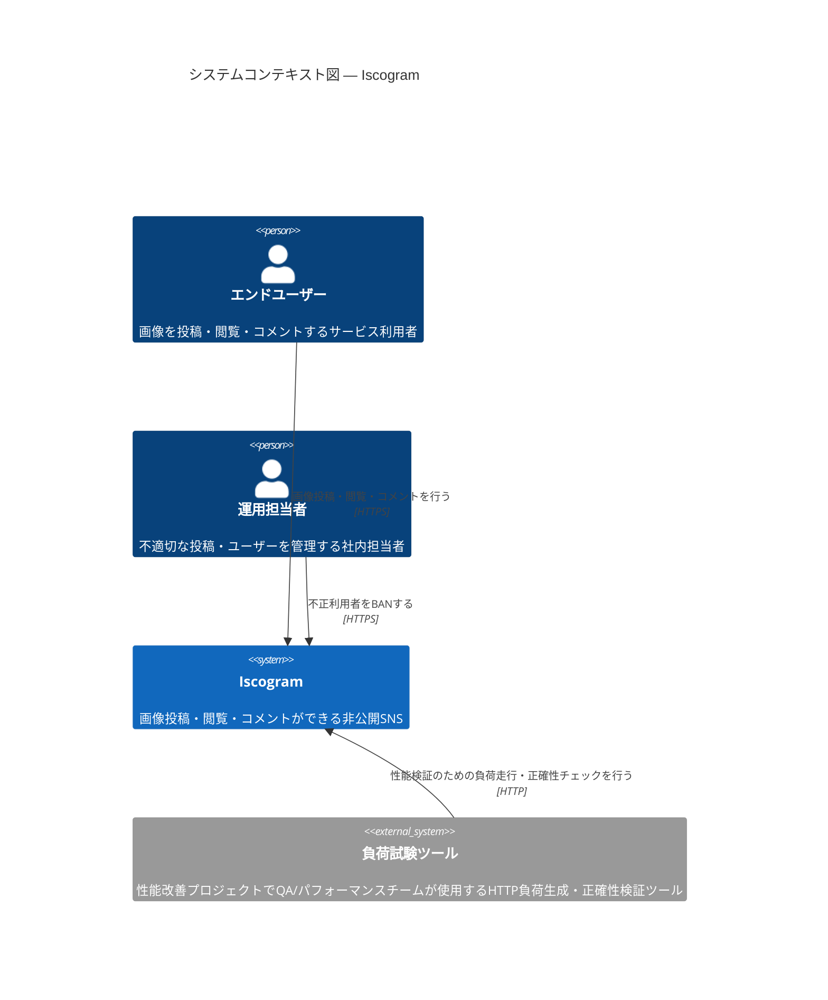
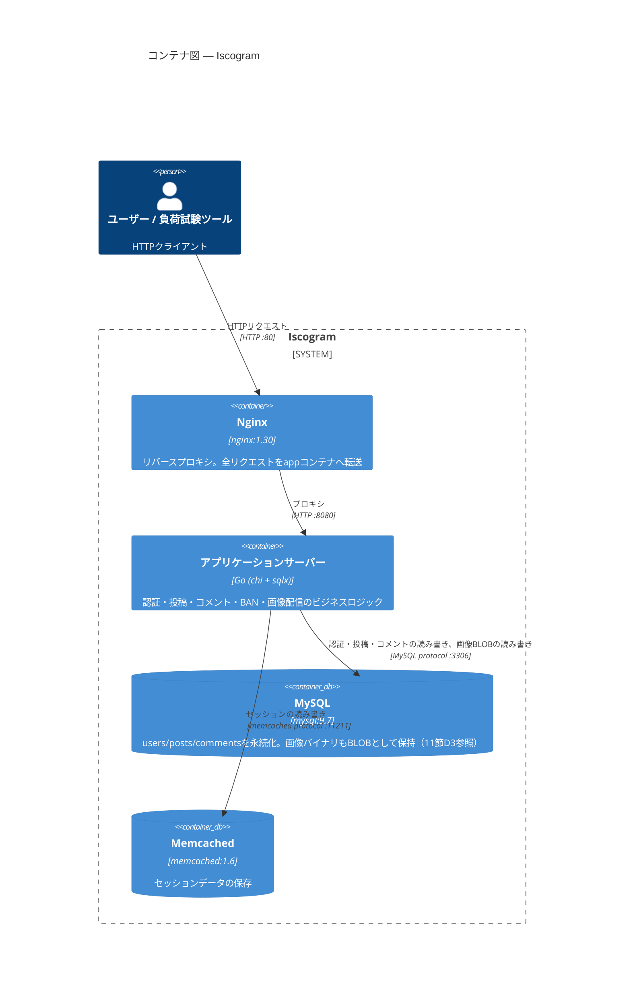
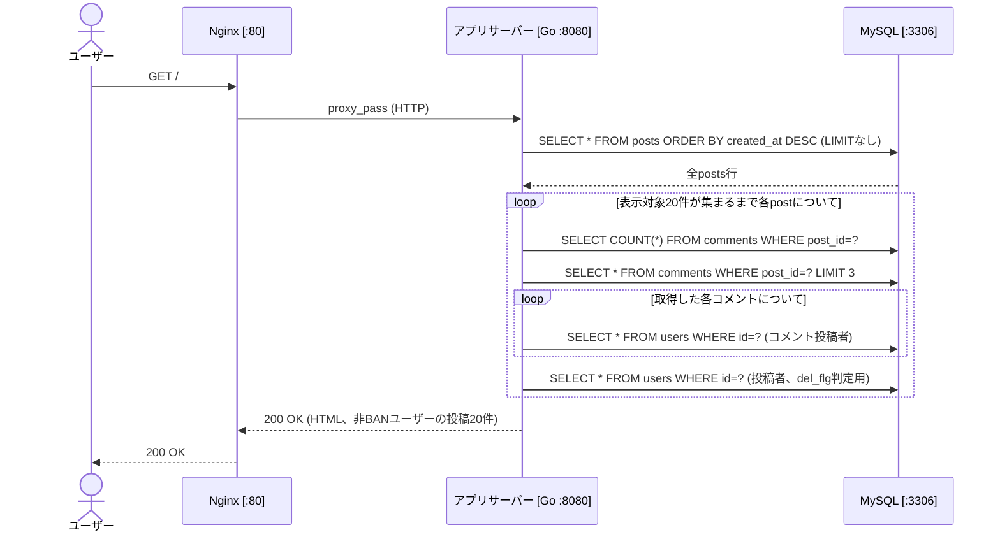
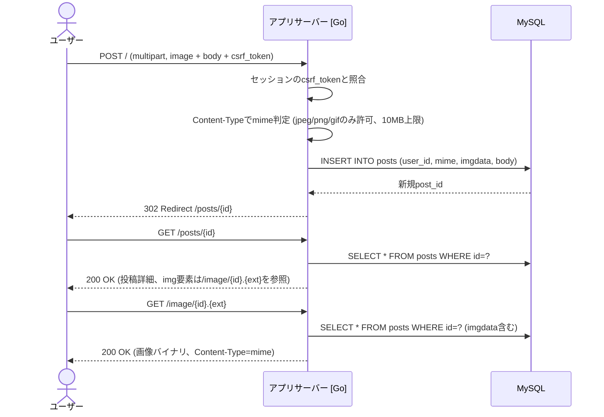
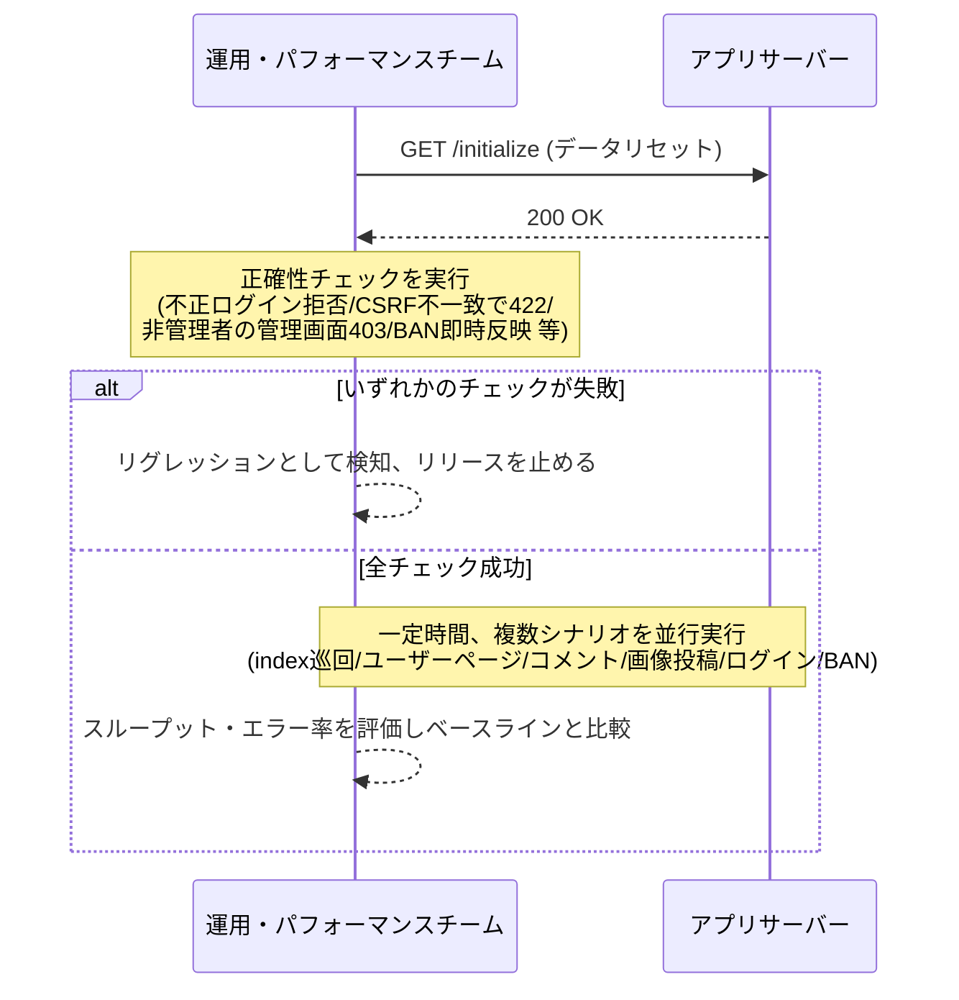
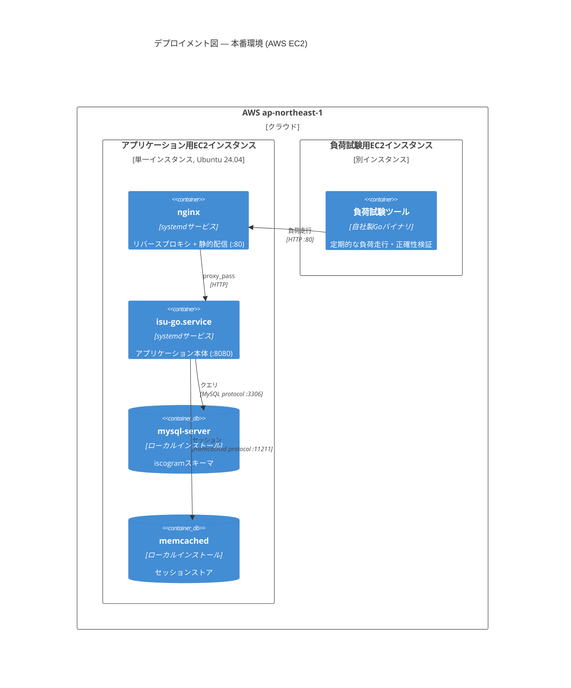

# Iscogram — アーキテクチャドキュメント

> arc42テンプレートに基づく、画像共有SNS「Iscogram」のアーキテクチャドキュメント。
> 現行の本番実装（`webapp/golang`）を対象に記述する。
> 本ドキュメントは、性能・信頼性・セキュリティ改善プロジェクトの一環として、
> 現行アーキテクチャの棚卸しと技術的負債・リスクの明確化を目的に作成した。

## 目次

- [1. 導入と目標](#1-導入と目標)
- [2. アーキテクチャ制約](#2-アーキテクチャ制約)
- [3. コンテキストとスコープ](#3-コンテキストとスコープ)
- [4. ソリューション戦略](#4-ソリューション戦略)
- [5. ビルディングブロックビュー](#5-ビルディングブロックビュー)
- [6. ランタイムビュー](#6-ランタイムビュー)
- [7. デプロイメントビュー](#7-デプロイメントビュー)
- [8. 横断的概念](#8-横断的概念)
- [10. 品質要件](#10-品質要件)
- [11. リスクと技術的負債](#11-リスクと技術的負債)
- [12. 用語集](#12-用語集)

---

## 1. 導入と目標

### 1.1 要件概要

Iscogram は、ユーザーが写真を投稿し、他ユーザーの投稿を閲覧・コメントできる非公開制の画像共有SNSである。主な機能は次の通り。

- ユーザー登録・ログイン認証
- 画像投稿（キャプション付き）
- 他ユーザー投稿へのコメント
- ユーザープロフィールページ（投稿一覧）
- 管理者によるユーザーBAN（不適切利用者のアカウント凍結）

現在、サービスの応答速度・可用性・セキュリティを底上げするための改善プロジェクトが進行中であり、本ドキュメントはその一環として現行アーキテクチャを可視化し、対処すべき課題を明確にすることを目的とする。

### 1.2 品質目標

| 優先度 | 品質目標 | 説明・シナリオ |
|--------|---------|--------------|
| 1 | 性能効率性 | タイムライン表示・画像投稿・画像配信のレイテンシを実用的な水準に抑える。現状はN+1クエリやインデックス欠如により悪化している（詳細は11節） |
| 2 | 可用性・信頼性 | 単一障害点を排除し、インスタンス再起動やデプロイ後もサービスを継続提供する |
| 3 | セキュリティ | 認証情報・セッション・アップロード画像を適切に保護する |
| 4 | 保守性 | コードベースの複雑性・重複を抑え、変更の影響範囲を予測可能にする |
| 5 | 運用性 | 障害の検知・原因調査に必要な可観測性を備える |

### 1.3 ステークホルダー

| 役割 | 主な期待事項 |
|------|------------|
| エンドユーザー | 高速なページ表示、投稿の即時反映、安全なアカウント管理 |
| プロダクト・開発チーム | 新機能を安全かつ迅速にリリースできること |
| SRE・運用チーム | 障害の早期検知、デプロイの容易さ、リソース使用状況の把握 |
| セキュリティ担当 | 認証・セッション管理・パスワード保管の堅牢性 |
| 性能改善プロジェクト担当者（本ドキュメントの主読者） | 現状のボトルネックと技術的負債の正確な棚卸し |

---

## 2. アーキテクチャ制約

### 技術的制約

| 制約 | 理由 |
|------|------|
| OSはUbuntu 24.04 | 現行インフラの標準OS |
| MySQL 9.7、Memcached 1.6、Nginx 1.30 を使用 | 現行の採用ミドルウェア（`webapp/compose.yml`） |
| バックエンド実装はGo（chi + sqlx） | 現行の本番実装。過去に複数言語が並行稼働していた経緯があり、Goへ一本化した（11節R6参照） |
| 画像投稿は10MBまで（Nginx `client_max_body_size` とアプリ`UploadLimit`） | 両レイヤーの設定を一致させる必要がある |
| セッションはCookieベース | 既存クライアント（Webブラウザ）との互換性維持のため |

### 組織・政治的制約

| 制約 | 理由 |
|------|------|
| 現状は単一のAWS EC2インスタンスで稼働している | インフラコスト制約。単一障害点となっている（11節リスクR1参照） |
| 小規模な開発チームで運用している | 大規模な並行開発や専任DBAの配置が難しい |
| 既存の外部から見える挙動（URL構造、DOM構造、Cookie仕様）を大きく変えずに性能改善を進める必要がある | 既存クライアント・ブックマーク・外部連携への影響を避けるため |

### 規約

| 規約 | 詳細 |
|------|------|
| DBスキーマ変更・インデックス追加・キャッシュ導入は積極的に行ってよい | 性能改善の主要な手段として推奨する |
| バックエンド実装言語はGoに統一する方針 | 保守コスト削減のため。過去に複数言語の実装が並行して存在していた経緯があり、順次整理する（11節リスクR6参照） |
| インフラ変更（Ansible等）はアプリケーションロジックの変更と分離してコミットする | 変更影響範囲を追跡しやすくするため |

---

## 3. コンテキストとスコープ

### 3.1 ビジネスコンテキスト



**パートナー一覧:**

| コミュニケーションパートナー | 方向 | やり取りする情報 |
|--------------------------|------|---------------|
| エンドユーザー | 双方向 | HTTPリクエスト（ログイン、投稿、コメント、画像取得）、HTML/画像レスポンス |
| 運用担当者（管理者） | 双方向 | 管理画面へのアクセス、BAN操作 |
| 負荷試験ツール | 双方向 | データリセット要求、負荷走行中のHTTPリクエスト一式、正確性検証のためのDOM/Cookieチェック |

### 3.2 テクニカルコンテキスト

| ビジネスI/O | チャネル・プロトコル | 技術的詳細 |
|-----------|------------------|----------|
| エンドユーザー操作 | HTTP | Nginx (`:80`) がリバースプロキシとしてアプリ (`:8080`) にプロキシ |
| 画像投稿 | HTTP multipart/form-data | 最大10MB（Nginx `client_max_body_size` とアプリ`UploadLimit`が一致） |
| 負荷試験ツールとの通信 | HTTP | データリセット用エンドポイント呼び出し → 正確性チェック → 一定時間の負荷走行 |
| DBアクセス | MySQL protocol (TCP/3306) | `sqlx` + `go-sql-driver/mysql`、`utf8mb4`、`ParseTime=true` |
| セッションストア | memcached protocol (TCP/11211) | `gorilla-sessions-memcache` によりセッションをMemcachedへ保存 |

---

## 4. ソリューション戦略

| 品質目標 | 現状の課題 | ソリューションアプローチ | 詳細 |
|---------|--------|-------------------|----|
| 性能効率性 | タイムライン表示・プロフィールページでN+1クエリと必要インデックスの欠如により応答が遅い | クエリのJOIN化・バッチ取得、複合インデックスの追加、必要に応じたキャッシュ層の導入 | セクション8・11参照 |
| 可用性・信頼性 | 単一AWS EC2インスタンスで稼働しており単一障害点になっている | マルチAZ構成・水平スケール可能な構成への移行を検討する | セクション7・11参照 |
| セキュリティ | パスワードハッシュ計算が弱いソルト運用かつ外部プロセス起動を伴う。セッション暗号鍵がハードコードされている | 標準的な鍵導出関数（bcrypt/argon2id）への置き換え、シークレット管理基盤への移行 | セクション8・11参照 |
| 保守性 | 過去の経緯で複数言語の実装が並行して残存している | Go実装への一本化を進め、不要な実装を段階的に廃止する | セクション5・11参照 |
| 運用性 | 構造化ログ・APM・スロークエリ分析ツールが未導入 | ログ基盤・メトリクス収集・アラートの整備 | セクション8・11参照 |

**最上位の分解:** Nginx（リバースプロキシ／静的配信）／アプリケーションサーバー（Go）／MySQL（永続化）／Memcached（セッションストア）の4コンポーネント構成。

**主要アーキテクチャパターン:** 同期的なリクエスト・レスポンス型のモノリシックWebアプリケーション。非同期処理・メッセージキューは現状導入されていない。

---

## 5. ビルディングブロックビュー

### レベル1: コンテナ図



**分解の動機:** Nginxとアプリケーションサーバーを分離することで、静的配信のオフロードや将来的なリバースプロキシ層でのキャッシュ導入余地を残している。MySQLとMemcachedを分離しているのは、セッションのような揮発性データと投稿データのような永続データの責務を分けるためである。ただし画像は現状もMySQLにBLOBとして格納されており、これは11節で挙げる技術的負債である。

**コンテナ説明表:**

| コンテナ | 技術 | 責務 |
|---------|------|------|
| Nginx | nginx:1.30 | リバースプロキシ（`webapp/etc/nginx/conf.d/default.conf`） |
| アプリケーションサーバー | Go: chi + sqlx + gomemcache | ルーティング、セッション管理、CSRF検証、画像アップロード/配信、BAN機能、静的ファイル配信 |
| MySQL | mysql:9.7 | `users`/`posts`/`comments`の永続化。`posts.imgdata`に画像バイナリを直接格納 |
| Memcached | memcached:1.6 | セッションストア（キー接頭辞`iscogram_`） |

### レベル2: アプリケーションサーバー内部構造

現行のGo実装（`webapp/golang/app.go`）はレイヤー分割された構造を持たない、単一ファイルのハンドラ集合である。これ自体も将来的な保守性向上の対象となりうる（11節D8参照）。

| ハンドラ群 | ルート | 責務 |
|-----------|--------|------|
| データリセット | `GET /initialize` | 負荷試験前のデータリセット処理（`id`範囲外削除、BAN状態の再適用）。スキーマ自体は変更しない |
| 認証 | `GET/POST /login`, `GET/POST /register`, `GET /logout` | セッション発行、パスワード検証、CSRFトークン発行 |
| タイムライン | `GET /`, `GET /posts`, `GET /posts/{id}`, `GET /@{accountName}` | 投稿一覧・個別投稿・ユーザーページの表示（`makePosts`関数がコメント・投稿者情報を都度クエリで取得） |
| 投稿・コメント | `POST /`, `POST /comment` | 画像投稿（MySQLへBLOB保存）、コメント投稿。いずれもCSRFトークン必須 |
| 画像配信 | `GET /image/{id}.{ext}` | MySQLから画像BLOBを取得しストリーミング配信 |
| 管理 | `GET/POST /admin/banned` | 管理者権限チェック、ユーザーBAN（`del_flg`更新） |
| 静的配信 | `Mount("/", http.FileServer(...))` | CSS/JS/faviconなどの配信（Nginxと機能重複しており整理余地あり） |

**過去に存在した他言語実装について:** リポジトリには現在もRuby/PHP/Python/Node.jsの実装が残存しているが、本番で稼働しているのはGo実装のみである（4節参照）。未使用実装の保守コストは技術的負債として11節で扱う。

---

## 6. ランタイムビュー

代表的な4シナリオを示す。

#### シナリオ1: タイムライン表示（N+1クエリが発生する経路）

**アクター:** エンドユーザー
**ゴール:** トップページに最新20件の投稿とその一部コメントを表示する



**課題:** `posts`テーブルに`LIMIT`が無いため全件取得後にアプリ側でBANユーザーを除外しながら20件に絞り込んでいる。1ページ表示につき概算120クエリ規模のN+1が発生しており、11節D1・D2で扱う本番の性能問題である。

#### シナリオ2: 画像投稿

**アクター:** ログイン済みユーザー
**ゴール:** 画像をアップロードし、投稿がタイムラインに反映される



**課題:** 画像がMySQLにBLOB格納されているため、投稿・配信のたびにDBへの読み書きコストが発生する（11節D3参照）。将来キャッシュ層やCDNを導入する場合も、アップロード内容と配信内容のバイト列の整合性を崩さないよう設計する必要がある。

#### シナリオ3: 定期負荷試験の実行フロー

**アクター:** 運用・パフォーマンスチーム（負荷試験ツール経由）
**ゴール:** リリース前後で性能・正確性のリグレッションがないか検証する



**運用上の位置づけ:** データリセット用エンドポイント（`/initialize`）は、負荷試験前にステージング環境相当のデータを既知の初期状態へ戻すために使用する内部運用機能である。10秒以内に応答しない場合、試験全体の信頼性が損なわれるため、SLOとして監視すべき対象である（10節QS-02参照）。

#### シナリオ4: BAN操作後の即時反映

**アクター:** 運用担当者（管理者）
**ゴール:** BANされたユーザーの投稿が即座にタイムラインから消えることを保証する

```
1. 管理者が /admin/banned でユーザーをBAN対象として選択しPOST
2. 直後にタイムラインを再取得し、BANされたユーザーの投稿が表示されないことを確認
```

**設計上の留意点:** このシナリオは、将来キャッシュ層やCDNを導入する際に注意すべき一貫性要件を示している。投稿を丸ごとキャッシュする設計にする場合、BAN状態の反映が遅延しないような無効化（invalidation）の仕組みを併せて設計する必要がある。

---

## 7. デプロイメントビュー

### インフラレベル1（概要）

現状、Iscogramには2つの実行環境がある。(a) ローカル開発用のDocker Compose環境、(b) 本番運用中のAWS EC2環境。




**ノード説明:**

| ノード | 種類 | 動くもの |
|--------|------|---------|
| アプリケーション用EC2（単一インスタンス） | AWS EC2 | Nginx、Goアプリ（`isu-go`のsystemdユニット）、MySQL、Memcachedが同居 |
| 負荷試験用EC2 | AWS EC2 | 自社製の負荷試験ツール |
| ローカルDocker Compose | Docker | 4コンテナ（nginx/app/mysql/memcached）。app/mysqlはCPU 1コア・メモリ1GBに制限 |

**主要なデプロイメント判断・課題:**
- 本番はアプリ・DB・キャッシュが単一インスタンスに同居しており、インスタンス障害時にサービス全体が停止する**単一障害点になっている**（11節リスクR1）。将来的にはDB・キャッシュ層を別インスタンス/マネージドサービスに切り出し、アプリサーバーを水平スケール可能にする構成への移行を検討すべきである。
- 設定は環境変数（`ISUCONP_DB_HOST`等）による注入方式で、ローカル・本番の両環境で一貫している。
- インフラ構築はAnsible（`provisioning/`）でコード化されている。

### インフラレベル2（環境詳細）

| 関心事 | ローカル(Docker Compose) | 本番(AWS EC2) |
|--------|------------------------|------------------------|
| OS | ホストOS＋Linuxコンテナ | Ubuntu 24.04 (EC2ネイティブ) |
| ミドルウェア導入方法 | Dockerイメージ（バージョン固定） | Ansibleによるapt/xbuildインストール |
| リソース制限 | app/mysqlに1 CPU/1GB (compose.yml) | インスタンスのスペック丸ごと（現状スケールアウト不可） |
| 監視・可観測性ツール | 提供なし | 提供なし（`journalctl -u isu-go`とNginxログのみ。11節リスクR4参照） |
| 冗長化 | なし（開発用） | なし（単一インスタンス、11節リスクR1参照） |

---

## 8. 横断的概念

### 認証・認可

- 認証はセッションCookie（`isuconp-go.session`）ベース。ログイン成功時に`user_id`をセッションに格納し、以降のリクエストで`getSessionUser`がMySQLへ問い合わせてユーザー情報を取得する。**リクエストごとにDBラウンドトリップが発生しており、ユーザー情報のキャッシュは行われていない**（11節D9参照）。
- 認可は2種類のフラグで制御される: `authority`（0以外が管理者、`/admin/banned`へのアクセス制御に使用）と`del_flg`（BAN状態。ログイン拒否とタイムライン非表示の両方に使用）。

### CSRF対策

- 登録・ログイン時に`secureRandomStr(16)`（`crypto/rand`による16バイトの乱数）でトークンを生成しセッションに保存する。
- `POST /`、`POST /comment`、`POST /admin/banned`の各フォームに埋め込まれた`csrf_token`をセッション値と比較し、不一致であればHTTP 422を返す。この仕組み自体は妥当な実装であり、変更時は既存クライアントとの互換性に注意する。

### セッション管理

- セッションストアはMemcached（`gorilla-sessions-memcache`、キー接頭辞`iscogram_`）。
- **セッション暗号鍵がコード中にハードコードされている**（環境変数やシークレット管理の仕組みから注入されていない）。これは本番運用上の重大なセキュリティ上の欠陥であり、11節R2で優先的に対処すべき課題として扱う。
- 社内ドキュメント（`CLAUDE.md`）には「セッションはDBに保存」という記載が残っているが、実際のコードはMemcachedに保存しており、**ドキュメントと実装に乖離がある**（11節R5参照）。

### パスワードハッシュ計算

- パスワードは`SHA-512(password + ":" + salt)`で保存され、`salt = SHA-512(account_name)`（ユーザーごとのランダムなソルトではなく、アカウント名から決定的に導出される）。これは**実質的にソルトの役割を果たしておらず**、レインボーテーブル攻撃への耐性が低い（11節R3参照）。
- ハッシュ計算はGoの標準ライブラリを使わず、`os/exec`で`/bin/bash -c`経由の`openssl dgst -sha512`を呼び出す実装になっている。これは認証リクエストのたびにプロセスを起動するオーバーヘッドを生み、**性能上のボトルネックにもなっている**（11節D4参照）。シェルインジェクション対策として独自のエスケープ処理は実装されているが、そもそも外部プロセス呼び出しに依存する設計自体を見直すべきである。

### 画像投稿・配信

- 画像はファイルシステムやオブジェクトストレージではなく、**MySQLの`posts.imgdata`（mediumblob）に直接格納**されている。配信時（`GET /image/{id}.{ext}`）は毎回DBからBLOB全体を取得してレスポンスボディにストリーミングしている。これはDBサイズの肥大化・配信レイテンシ・バックアップ時間の増大を招いており、**早期に解消すべき技術的負債**である（11節D3参照）。
- MIME判定はアップロード時の`Content-Type`ヘッダの部分一致、配信時はURLの拡張子と保存済みMIMEの一致確認で行っている。
- 静的アセット（CSS/JS/favicon）はGoアプリの`http.FileServer`とNginxの両方で配信可能な状態になっており、実際のルーティングはNginx設定に依存する。配信経路が重複しており整理の余地がある。

### エラーハンドリングとロギング

- 明示的な構造化ロギング機構やAPMは導入されていない。障害調査は`journalctl -u isu-go`（アプリ）と`/var/log/nginx/error.log`（Nginx）に依存しており、原因特定に時間がかかる状態である（11節R4参照）。

### 監視・可観測性

- `alp`、`pt-query-digest`、`netdata`などの計測ツールは標準では導入されていない。スロークエリの特定やレイテンシの内訳分析ができない状態であり、性能改善プロジェクトを進める上でも早急に整備すべき基盤である（11節R4参照）。

### 実装言語の一本化

- 現在はGo実装のみが本番稼働しているが、リポジトリには過去の経緯でRuby/PHP/Python/Node.jsの実装も残存している。未使用実装の保守・依存関係更新にコストがかかっており、誤って古い実装がデプロイされるリスクもある（11節R6参照）。

---

## 10. 品質要件

### 10.1 品質ツリー・概要

| カテゴリ | 要件 | 優先度 |
|---------|------|--------|
| #efficient | タイムライン・画像投稿・画像配信のレイテンシ改善 | 高 |
| #reliable | データリセット処理（`/initialize`）が短時間で完了すること | 高 |
| #testable | 認証・CSRF・BAN即時反映などの正確性チェックが継続的に成功すること | 高 |
| #secure | パスワードハッシュ・セッション鍵管理の脆弱性を解消すること | 重大 |
| #operable | インスタンス障害時にも復旧・サービス継続ができること | 高 |
| #maintainable | 未使用の実装・設定ドリフトを解消し保守性を高めること | 中 |

arc42品質ハッシュタグ: `#efficient` `#reliable` `#testable` `#secure` `#operable` `#maintainable`

### 10.2 品質シナリオ

**QS-01: 負荷試験によるベースライン計測（実測値）**
```
品質: 性能効率性
刺激: 負荷試験ツールが60秒間、index巡回・投稿・コメント・画像アップロード・ログイン・BANの各シナリオを並行実行する
応答: 現状のベースラインは60秒間で成功リクエスト数約5,700件（エラー0件）。
      N+1クエリ・インデックス欠如の解消後、同一負荷でのスループット向上を目標とする
```

**QS-02: データリセット処理のレイテンシ（長形式・SEI/Bassフォーマット）**
```
ID: QS-02
名称: 負荷試験前のデータリセット処理
発生源: 負荷試験ツール
刺激: GET /initialize を送信する
環境: 負荷試験開始直前
対象: アプリケーションサーバー
応答: 短時間（実測値: 数ミリ秒〜10秒以内）で200 OKを返し、users/posts/commentsを既定の初期状態にリセットする
応答の尺度: 10秒を超過した場合、試験結果全体の信頼性が損なわれるため、SLO違反として扱う
```

**QS-03: 正確性の継続的な担保（短縮形）**
```
品質: 機能的正確性
刺激: 不正なCSRFトークンで投稿する / 非管理者が管理画面にアクセスする / 存在しないユーザーでログインする
応答: それぞれ422 / 403 / ログイン失敗メッセージを返す。いずれかが仕様と異なる場合はリグレッションとして検知し、リリースを止める
```

**QS-04: BAN即時反映（短縮形）**
```
品質: 一貫性（セキュリティ・プライバシーの観点を含む）
刺激: 管理者がユーザーをBANする
応答: 直後のタイムライン取得で、BANされたユーザーの投稿が一切表示されない（キャッシュ層を挟んでも遅延なく反映される）
```

---

## 11. リスクと技術的負債

### リスク台帳

| # | リスク | 発生確率 | 影響度 | 緩和策 |
|---|--------|---------|--------|-------|
| R1 | 本番がアプリ・DB・キャッシュ同居の単一AWS EC2インスタンスで稼働しており、単一障害点になっている | 中 | 重大（インスタンス障害でサービス全停止） | DB・キャッシュ層の切り出し、マルチAZ化、アプリサーバーの水平スケール構成への移行 |
| R2 | セッション暗号鍵がコードにハードコードされている | 中 | 高（鍵漏洩時にセッション偽造が可能） | 環境変数またはシークレット管理基盤（AWS Secrets Manager等）への移行 |
| R3 | パスワードのソルトがアカウント名から決定的に導出されており、実質的にソルトの役割を果たしていない | 中 | 高（レインボーテーブル攻撃への耐性が低い） | bcrypt/argon2idなど、ソルト・ストレッチングを内蔵した鍵導出関数への移行 |
| R4 | 構造化ログ・APM・スロークエリ分析ツールが未導入で、障害調査に時間がかかる | 高 | 中 | ログ基盤・メトリクス収集・アラートの整備、`alp`/`pt-query-digest`等の導入 |
| R5 | 社内ドキュメント（`CLAUDE.md`）に実装との乖離がある（例: セッション保存先の記載誤り、MySQLバージョンの記載誤り） | 中 | 低〜中（新規メンバー・関係者の誤解を招く） | ドキュメントを実装に合わせて更新する運用を定着させる |
| R6 | 未使用の複数言語実装（Ruby/PHP/Python/Node.js）がリポジトリに残存し、保守コストと誤デプロイのリスクを生んでいる | 中 | 中 | 不要な実装の廃止、デプロイパイプラインの対象を明示的にGo実装のみへ限定する |

### 技術的負債台帳

| # | 負債 | 影響 | 解消策 | 優先度 |
|---|------|------|-------|--------|
| D1 | `posts`/`comments`テーブルに`user_id`/`post_id`/`created_at`へのインデックスが存在しない | タイムライン・ユーザーページ表示が全表スキャンに近い挙動になり、DB負荷とレイテンシが増大する | 複合インデックスの追加 | 高 |
| D2 | `getIndex`/`getAccountName`/`getPosts`のN+1クエリ（1ページ表示で概算120クエリ） | レイテンシ・DB負荷の主要因 | JOIN化・バッチ取得、必要に応じたアプリ側キャッシュ導入 | 高 |
| D3 | 画像をMySQLにBLOB格納しており、配信のたびに全バイト列をDBから読み出す | DBサイズ肥大化、配信レイテンシ増大、バックアップ時間の増大 | ファイルシステム/オブジェクトストレージ（S3互換）+ CDNへの移行 | 高 |
| D4 | パスワードハッシュ計算が`openssl`への外部プロセス起動を伴う | 認証系エンドポイントのレイテンシ増大、プロセス起動数の増加によるCPU負荷 | Go標準の`crypto/`パッケージまたはbcrypt/argon2idライブラリへの置き換え（R3の対応と合わせて実施） | 高 |
| D5 | セッション暗号鍵のハードコード（R2と表裏の実装課題） | 秘密情報のソースコード混入 | シークレット管理基盤からの注入に変更 | 高 |
| D6 | 未使用の他言語実装（Ruby/PHP/Python/Node.js）の保守コスト | 依存関係更新・脆弱性対応の対象が不必要に広い | 実装の棚卸しと段階的な削除 | 中 |
| D7 | 監視・可観測性ツールの不在（R4と表裏） | 性能改善の効果測定・障害調査が困難 | ログ基盤・APM・スロークエリ分析ツールの導入 | 高 |
| D8 | Go実装（`app.go`）がレイヤー分割されていない単一ファイル構成 | 機能追加時の見通しの悪化、テスト容易性の低さ | ハンドラ・データアクセス層・ドメインロジックの分離 | 中 |
| D9 | `getSessionUser`がリクエストごとにMySQLへ問い合わせており、ユーザー情報のキャッシュがない | 認証を伴う全リクエストにDBラウンドトリップが乗る | Memcached等へのユーザー情報キャッシュ導入（BAN即時反映との整合に注意） | 中 |
| D10 | デプロイ設定とコードのドリフト（例: `isu-go.service`が解釈されない`-bind`フラグを渡している） | 設定変更が意図通りに反映されない可能性 | systemdユニットとアプリケーションの起動オプションの整合性確認 | 低 |

**優先順位の考え方:** D1・D2・D3・D4・D5・D7（性能・セキュリティ・運用性に直結する項目）を最優先で解消し、D6・D8・D9・D10は継続的な保守性改善として計画に組み込む。

---

## 12. 用語集

| 用語 | 定義 |
|------|------|
| Iscogram | 本ドキュメントが対象とする画像投稿SNSサービスの名称（セッションCookie接頭辞`iscogram_`に由来） |
| 負荷試験ツール | `benchmarker/`配下の自社製Goツール。正確性チェックと一定時間の負荷走行を行い、性能のベースライン計測・リグレッション検知に使う |
| `/initialize` | 負荷試験実行前に呼び出される、データリセット用の内部エンドポイント |
| BAN（`del_flg`） | 管理者がユーザーの投稿・ログインを無効化する機能。`users.del_flg=1`で表現される |
| authority | ユーザーの管理者権限を表すフラグ（`users.authority`）。0以外が管理者 |
| CSRFトークン | フォーム送信時の不正リクエスト防止用トークン。セッションに保存され、POST時にフォーム値と照合される |
| N+1クエリ | 一覧取得時に、関連データを1件ずつ個別クエリで取得してしまうことで発生するクエリ数の増大。本アプリのタイムライン表示で発生している |
| provisioning | `provisioning/`配下のAnsible Playbook群。本番用・負荷試験用インスタンスの環境構築を自動化する |
