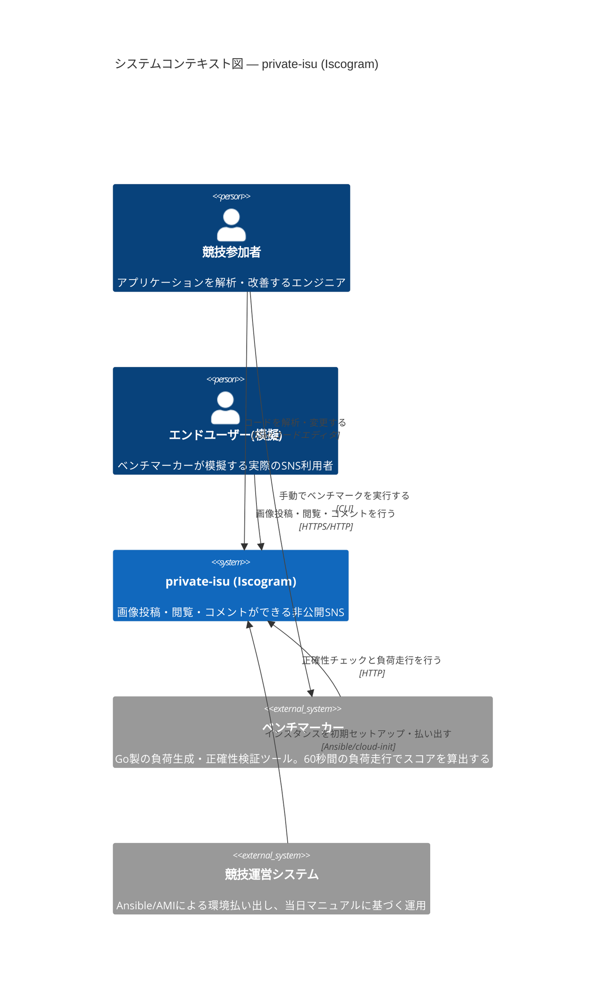
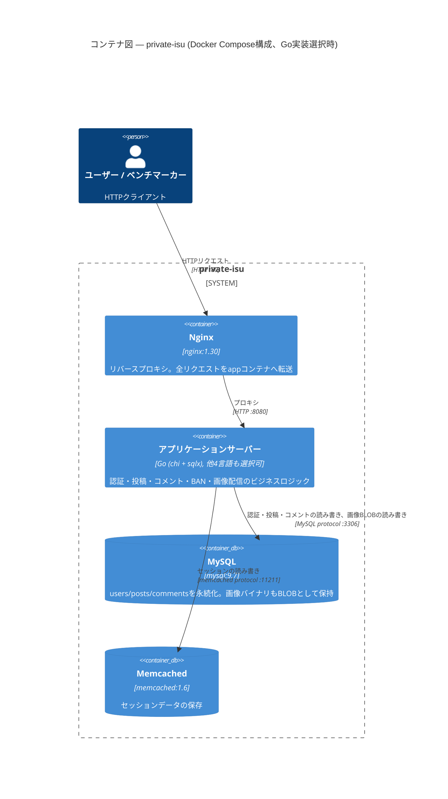
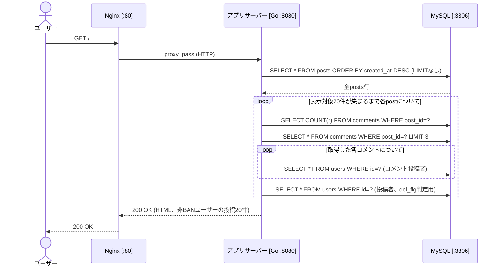
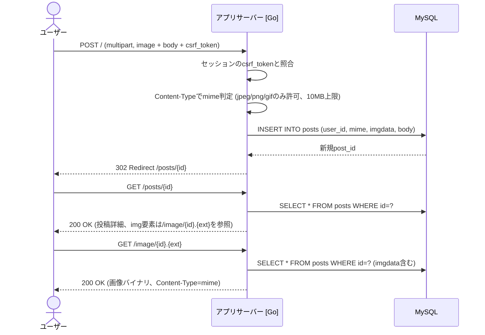
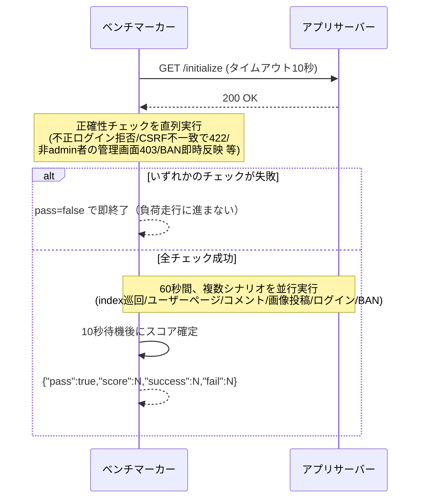
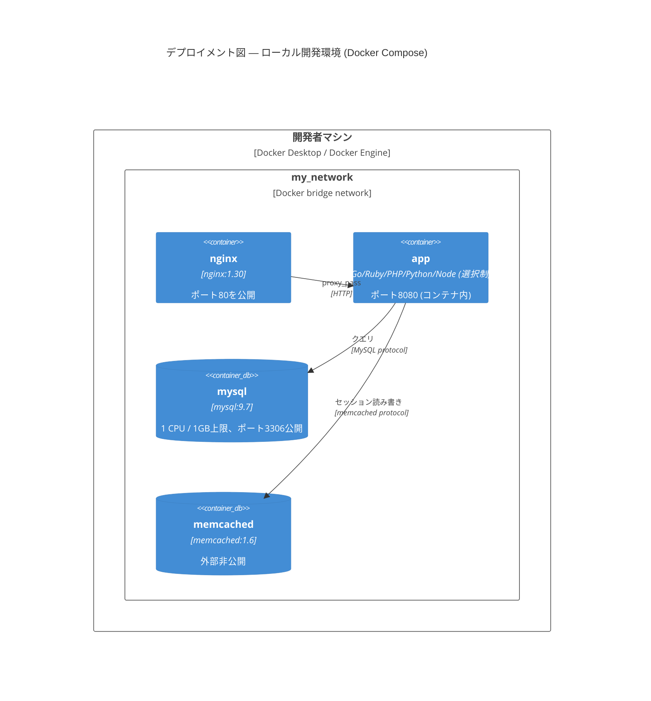
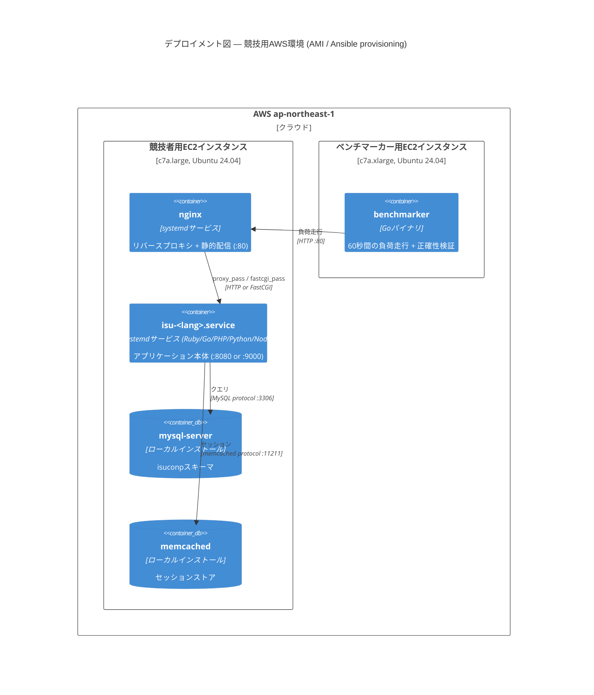

# private-isu — アーキテクチャドキュメント

> arc42テンプレートに基づく、ISUCON練習用リポジトリ「private-isu」のアーキテクチャドキュメント。
> 本ドキュメントは主に `webapp/golang`（Go参考実装）を対象コンテナとして記述するが、
> DBスキーマ・ネットワーク境界・ベンチマーカー仕様は全5言語実装で共通である。

## 目次

- [1. 導入と目標](#1-導入と目標)
- [2. アーキテクチャ制約](#2-アーキテクチャ制約)
- [3. コンテキストとスコープ](#3-コンテキストとスコープ)
- [4. ソリューション戦略](#4-ソリューション戦略)
- [5. ビルディングブロックビュー](#5-ビルディングブロックビュー)
- [6. ランタイムビュー](#6-ランタイムビュー)
- [7. デプロイメントビュー](#7-デプロイメントビュー)
- [8. 横断的概念](#8-横断的概念)
- [9. アーキテクチャ決定](#9-アーキテクチャ決定)
- [10. 品質要件](#10-品質要件)
- [11. リスクと技術的負債](#11-リスクと技術的負債)
- [12. 用語集](#12-用語集)

---

## 1. 導入と目標

### 1.1 要件概要

private-isu は、ISUCON（Iikanjini Speed Up Contest、LINE株式会社の登録商標）形式のWebパフォーマンスチューニング競技のための練習用お題アプリケーションである。アプリケーション自体は「Iscogram」という名称の非公開制の写真共有SNS（Twitter/Instagramに類似）で、ユーザー登録・ログイン、画像投稿（キャプション付き）、他ユーザー投稿へのコメント、管理者によるユーザーBAN機能を備える。

主な目的は機能開発ではなく、**意図的に性能上の問題を埋め込んだ参考実装を、参加者が計測・分析・改善するトレーニング環境を提供すること**である。Ruby（デフォルト起動）・Go・PHP・Python・Node.jsの5言語で機能的に同一の参考実装が用意されており、参加者はいずれかをベースに、または独自実装に置き換えて高速化に取り組む。

詳細な競技レギュレーションは [`manual.md`](../manual.md)（当日マニュアル）および [`public_manual.md`](../public_manual.md)（事前公開レギュレーション）を参照。

### 1.2 品質目標

| 優先度 | 品質目標 | 説明・シナリオ |
|--------|---------|--------------|
| 1 | 性能効率性 | ベンチマーカーが60秒間の負荷走行で生成する成功リクエスト数（GET/POST/画像投稿）を最大化し、エラー・タイムアウトを最小化する（採点式は10.2節参照） |
| 2 | 機能的な忠実性（正確性） | チューニング後も、DOM構造・Cookie/セッション挙動・CSRF検証・BANの即時反映など「外部から観測可能な振る舞い」を変更前と一致させる |
| 3 | 再現性・可搬性 | Docker Compose・Ansible（AMI）・cloud-initのいずれからでも同一のアプリケーション状態を再現できる |
| 4 | 保守性（教材としての） | 5言語実装間でスキーマ・ルーティング・ベンチマーカー仕様の整合を維持し、どの言語でも同じ問題を解けるようにする |
| 5 | 復旧性 | インスタンス再起動やベンチマーカーの `/initialize` 呼び出し後も、正しいデータ状態・設定で動作を継続する |

品質目標1（性能）と品質目標2（正確性）はしばしばトレードオフの関係にあり、ベンチマーカーは正確性チェックに1件でも失敗すると採点フェーズに進まず `pass:false` を返す（10節参照）。つまり本システムでは**正確性が性能より優先されるゲート条件**として設計されている。

### 1.3 ステークホルダー

| 役割 | 氏名・チーム | 主な期待事項 |
|------|------------|------------|
| 競技参加者（コンテスタント） | — | 単一のAWS EC2インスタンス上でアプリケーションを解析・改善し、ベンチマークスコアを最大化する |
| 競技運営・出題者 | pixiv社内ISUCON運営 → 書籍化に伴う一般公開版のメンテナ | ルールの公平性、環境の再現性、参考実装の教育的妥当性を担保する |
| ベンチマーカー（自動化された審判） | `benchmarker/` | 正確性チェックと負荷走行を行い、公平なスコアを算出する |
| リポジトリメンテナ／コントリビュータ | GitHub上のOSSコントリビュータ | 5言語実装・provisioning・依存関係の整合性を維持する（[`AGENTS.md`](../AGENTS.md)にAIエージェント向けの明示的な方針あり） |
| 書籍読者・学習者 | 『達人が教えるWebパフォーマンスチューニング』読者 | 手元環境で書籍と同じ手順を再現できる |

---

## 2. アーキテクチャ制約

### 技術的制約

| 制約 | 理由 |
|------|------|
| OSはUbuntu 24.04 | 配布AMI・provisioningの前提OS |
| MySQL 9.7、Memcached 1.6、Nginx 1.30 を使用（Docker Compose環境） | `webapp/compose.yml` で固定バージョン指定。ローカルではDBAが存在しないため運用が容易なミドルウェアを採用 |
| 画像投稿は10MBまで（`client_max_body_size 10m` とアプリ側 `UploadLimit`） | Nginx・アプリ双方の設定が一致している必要がある（1つを変えるともう1つも変える必要あり） |
| セッションはCookieベース（`isuconp-go.session` など言語ごとの名称） | ベンチマーカーがCookie/セッション経由でログイン状態を検証するため |
| 外部から見えるURI・HTTPパス、レスポンスHTMLのDOM構造、JS/CSSファイル内容、画像・動画メディアファイル内容は変更不可 | `public_manual.md` に明記された競技規約。ベンチマーカーが固定MD5チェックとDOM要素チェックで検証する |
| `GET /initialize` は10秒以内に応答すること | 応答しない場合、そのラン全体が失格になる（`benchmarker/cli.go` の `InitializeTimeout` と一致） |

### 組織・政治的制約

| 制約 | 理由 |
|------|------|
| 参加者は運営提供の単一AWS EC2インスタンスのみ使用可能 | 外部リソースへの計算オフロードによる不公平を防止するため（`public_manual.md`） |
| 他チームへの妨害行為は禁止 | 公正な競技運営のため |
| ベンチマーク実行時間は1分間固定 | 採点の一貫性・再現性を担保するため |
| 参考実装（Ruby/PHP等）の性能同等性は運営が保証しない | 各言語の実装品質・ランタイム特性の違いを運営が制御できないため |

### 規約

| 規約 | 詳細 |
|------|------|
| DBスキーマの変更・インデックス追加・キャッシュ導入・非同期化・言語の総入れ替えは自由 | `public_manual.md` に明記。性能改善の主戦場として意図的に許可されている |
| 「お題」としての非効率性は原則として保持する | [`AGENTS.md`](../AGENTS.md) の "Preserve the Exercise Before Improving the Code" 原則。N+1クエリ、`LIMIT`なしSQL、画像のDB格納、外部コマンド経由のハッシュ計算、リクエスト毎のテンプレートパースは"バグ"ではなく意図的な教材 |
| 5言語実装は外部から観測可能な振る舞い（ルーティング、スキーマ、初期化、セッション、Cookie、CSRF、リダイレクト、テンプレート出力、時刻表現）を一致させる | 1言語の変更が他4言語に影響しないか確認する運用ルール（AGENTS.md） |
| ベンチマーカー自体は「お題の一部」であり改善対象ではない | ベンチマーカーの挙動を変えると、そもそも何を採点しているかが変わってしまうため |
| 依存関係・ランタイム・OS・ミドルウェアの更新は、お題本体の変更と分離してコミットする | Renovateによる自動更新（`renovate.json`）を教材変更と混同しないため |

---

## 3. コンテキストとスコープ

### 3.1 ビジネスコンテキスト

private-isu（Iscogram）は、エンドユーザー（実際にはベンチマーカーが模擬する）がログインして画像を投稿し、他ユーザーの投稿を閲覧・コメントできるSNSである。加えて、競技の外側には「参加者」「ベンチマーカー」「運営」という、通常のWebサービスにはない競技特有のアクターが存在する。



**パートナー一覧:**

| コミュニケーションパートナー | 方向 | やり取りする情報 |
|--------------------------|------|---------------|
| エンドユーザー（実際はベンチマーカーが模擬） | 双方向 | HTTPリクエスト（ログイン、投稿、コメント、画像取得）、HTML/画像レスポンス |
| ベンチマーカー | 双方向 | `GET /initialize` による初期化要求、負荷走行中のHTTPリクエスト一式、正確性検証のためのDOM/Cookieチェック |
| 競技参加者 | 参加者→システム | コード変更、ミドルウェア設定変更、インフラ構成変更 |
| 競技運営（Ansible/AMI/cloud-init） | 運営→システム | 初期構築時のみ。OS・ミドルウェア・アプリケーションのプロビジョニング |

### 3.2 テクニカルコンテキスト

| ビジネスI/O | チャネル・プロトコル | 技術的詳細 |
|-----------|------------------|----------|
| エンドユーザー操作 | HTTP | Nginx (`:80`) がリバースプロキシとしてアプリ (`:8080`) にプロキシ |
| 画像投稿 | HTTP multipart/form-data | 最大10MB（Nginx `client_max_body_size` とアプリ`UploadLimit`が一致） |
| ベンチマーカー通信 | HTTP | `GET /initialize`（10秒以内に応答必須）→ 正確性チェック → 60秒間の負荷走行 |
| DBアクセス | MySQL protocol (TCP/3306) | `sqlx` + `go-sql-driver/mysql`、`utf8mb4`、`ParseTime=true` |
| セッションストア | memcached protocol (TCP/11211) | `gorilla-sessions-memcache` によりセッションをmemcachedへ保存 |
| プロビジョニング | SSH + Ansible | 競技用/ベンチマーカー用の2種類のインスタンスをそれぞれ構築 |

---

## 4. ソリューション戦略

| 品質目標 | シナリオ | ソリューションアプローチ | 詳細 |
|---------|--------|-------------------|----|
| 教育的忠実性 | 参加者が意図的なボトルネックを発見・修正する体験を提供する | 参考実装に**意図的な非効率性**（画像のDB BLOB格納、N+1クエリ、`LIMIT`なしSQL、外部コマンド経由のハッシュ計算、インデックス欠如）を埋め込む | セクション8・9・11参照 |
| 多言語対応 | Ruby/Go/PHP/Python/Node.jsのどの言語でも同じ問題を解ける | 全実装が同一のMySQLスキーマ・同一のセッションCookie挙動・同一のルーティングを持つよう統一する。ベンチマーカーは実装言語に依存しないHTTPクライアントとして動作する | セクション5・8参照 |
| 公平な採点 | 性能だけでなく正確性も評価する | ベンチマーカーに、性能計測の**前段**として正確性チェック（CSRF検証・BAN即時反映・キャッシュ汚染防止など）を組み込み、1件でも失敗すれば採点フェーズに進ませない | セクション6・10参照 |
| 再現可能な環境構築 | ローカルでも本番同等（AWS AMI）でも同じ動作を再現する | Docker Compose・Ansible Playbook・cloud-initの3系統の構築手段を提供し、いずれも同一のGitHub Release成果物（`dump.sql.bz2`、`img.zip`）を初期データソースとして共有する | セクション7参照 |
| リソース制約下でのチューニング | 本番相当のリソース制約（competitor: `c7a.large`）に近い環境をローカルでも再現する | Docker Composeで `app`/`mysql` サービスにCPU 1コア・メモリ1GBの上限を明示的に設定する | `webapp/compose.yml` |

**最上位の分解:** Nginx（リバースプロキシ／静的配信）／アプリケーションサーバー（5言語から選択）／MySQL（永続化）／Memcached（セッションストア）の4コンテナ構成。

**主要アーキテクチャパターン:** 同期的なリクエスト・レスポンス型のモノリシックWebアプリケーション。非同期処理・メッセージキューは標準では存在せず、これも「参加者が必要に応じて追加する」設計上の余地として残されている。

---

## 5. ビルディングブロックビュー

### レベル1: コンテナ図



**分解の動機:** Nginxとアプリケーションサーバーを分離しているのはISUCON全般の定石構成（静的配信のオフロード余地を参加者に残すため）。MySQLとMemcachedを分離しているのは、セッションのような揮発性データと投稿データのような永続データの責務を分けるため。ただし本アプリのGo実装では画像は依然としてMySQLにBLOBとして格納されており、ファイルシステム/オブジェクトストレージへの移行は行われていない（意図的な改善余地、9節ADR-1参照）。

**コンテナ説明表:**

| コンテナ | 技術 | 責務 |
|---------|------|------|
| Nginx | nginx:1.30 | リバースプロキシ（`webapp/etc/nginx/conf.d/default.conf`）。PHP選択時のみ静的ファイル配信とFastCGI振り分けも担当 |
| アプリケーションサーバー | Go: chi + sqlx + gomemcache（他: Ruby/Sinatra、PHP/Slim、Python/Flask、Node/Hono） | ルーティング、セッション管理、CSRF検証、画像アップロード/配信、BAN機能、静的ファイル配信（Go実装は`http.FileServer`も兼務） |
| MySQL | mysql:9.7 | `users`/`posts`/`comments`の永続化。`posts.imgdata`に画像バイナリを直接格納 |
| Memcached | memcached:1.6 | セッションストア（キー接頭辞`iscogram_`） |

### レベル2: アプリケーションサーバー内部構造（Go実装）

Go実装（`webapp/golang/app.go`、単一ファイル・874行）はレイヤー分割されたコンポーネント構造を持たないシンプルなHTTPハンドラ集合であるため、自動生成ツール向けのコンポーネント図ではなく、責務ごとのハンドラ一覧として示す（ISUCON参考実装は意図的に単純な構造を保っている）。

| ハンドラ群 | ルート | 責務 |
|-----------|--------|------|
| 初期化 | `GET /initialize` | ベンチマーク開始前のデータリセット（`id`範囲外削除、BAN状態の再適用）。スキーマ自体は変更しない |
| 認証 | `GET/POST /login`, `GET/POST /register`, `GET /logout` | セッション発行、SHA-512ベースのパスワード検証、CSRFトークン発行 |
| タイムライン | `GET /`, `GET /posts`, `GET /posts/{id}`, `GET /@{accountName}` | 投稿一覧・個別投稿・ユーザーページの表示（`makePosts`関数がコメント・投稿者情報を都度クエリで取得） |
| 投稿・コメント | `POST /`, `POST /comment` | 画像投稿（MySQLへBLOB保存）、コメント投稿。いずれもCSRFトークン必須 |
| 画像配信 | `GET /image/{id}.{ext}` | MySQLから画像BLOBを取得しストリーミング配信 |
| 管理 | `GET/POST /admin/banned` | 管理者権限チェック、ユーザーBAN（`del_flg`更新） |
| 静的配信 | `Mount("/", http.FileServer(...))` | CSS/JS/faviconなどの配信（Nginxと機能重複） |

---

## 6. ランタイムビュー

代表的な4シナリオを示す。いずれもベンチマーカー（`benchmarker/scenario.go`）が実際に検証する振る舞いである。

#### シナリオ1: タイムライン表示（N+1クエリが発生する経路）

**アクター:** エンドユーザー（ベンチマーカーの`loadIndexScenario`）
**ゴール:** トップページに最新20件の投稿とその一部コメントを表示する



**備考:** `posts`テーブルに`LIMIT`が無いため全件取得後にアプリ側でBANユーザーを除外しながら20件に絞り込む。1ページ表示につき概算120クエリ規模のN+1が発生する（意図的なボトルネック、11節参照）。

#### シナリオ2: 画像投稿

**アクター:** ログイン済みユーザー（`postImageScenario`）
**ゴール:** 画像をアップロードし、投稿がタイムラインに反映される



**備考:** ベンチマーカーはアップロードした画像とレスポンス画像のMD5一致を検証する（`postImageScenario`）ため、キャッシュ層を追加する場合もバイナリの整合性を崩してはならない。

#### シナリオ3: ベンチマーク実行フロー（正確性ゲート→負荷走行）

**アクター:** ベンチマーカー
**ゴール:** 正確性を確認した上でスコアを算出する



#### シナリオ4: BANシナリオ（キャッシュ汚染防止の検証）

**アクター:** ベンチマーカー（`banScenario`）
**ゴール:** BANされたユーザーの投稿が即座にタイムラインから消えることを確認する（安易な全体キャッシュへの対策）

```
1. 新規ユーザーを登録し画像を1件投稿（MD5照合で表示確認）
2. 管理者としてログインし、投稿が見えることを確認
3. /admin/banned のCSRFトークンと対象ユーザーIDを取得しBANをPOST
4. 直後にタイムラインを再取得し、BANされたユーザーの投稿が表示されないことを確認
```

**ヒント:** このシナリオは「投稿を丸ごとCDN/リバースプロキシでキャッシュする」といった安易な高速化を無効化するために存在する。キャッシュ導入時はBAN状態の反映遅延がないよう設計する必要がある。

---

## 7. デプロイメントビュー

### インフラレベル1（概要）

private-isuには性質の異なる2つの実行環境がある。(a) ローカル開発・練習用のDocker Compose環境、(b) 実競技用のAWS EC2環境（AMIまたはAnsibleによるprovisioning）。





**ノード説明:**

| ノード | 種類 | 動くもの |
|--------|------|---------|
| 競技者用EC2 (`c7a.large`) | AWS EC2 | Nginx、選択された1言語のアプリ (`isu-ruby`/`isu-go`/`isu-python`/`isu-node`のsystemdユニット、またはOS標準の`php8.3-fpm`)、MySQL、Memcached |
| ベンチマーカー用EC2 (`c7a.xlarge`) | AWS EC2 | `benchmarker`バイナリ（コンピューティング最適化インスタンス推奨） |
| ローカルDocker Compose | Docker | 4コンテナ（nginx/app/mysql/memcached）。app/mysqlはCPU 1コア・メモリ1GBに制限 |

**主要なデプロイメント判断:**
- 本番相当インフラはAnsible（`provisioning/image/ansible/`、`provisioning/bench/ansible/`）でコード化されており、`xbuild`によりRuby/Node/Python/Goをソースからビルドし`/home/isucon/.local/`配下に配置、PHPのみAPTパッケージ（`php8.3-fpm`）を利用する。
- 言語切り替えは「該当言語のsystemdユニットを有効化し、他を停止する」運用（PHPのみNginxのsite設定シンボリックリンクの張り替えも必要）。
- 設定は`/home/isucon/env.sh`による環境変数注入（`ISUCONP_DB_USER=isuconp`等）。Docker Compose環境では`compose.yml`の`environment:`で同じ変数を注入しており、設定注入の方式自体は両環境で一貫している。
- 初期データ（`dump.sql.bz2`、`img.zip`）はいずれの環境でも同一のGitHub Releaseアーティファクトから取得され、環境間のデータ整合性を担保している。

### インフラレベル2（環境詳細）

| 関心事 | ローカル(Docker Compose) | 競技用(AWS AMI/Ansible) |
|--------|------------------------|------------------------|
| OS | ホストOS＋Linuxコンテナ | Ubuntu 24.04 (EC2ネイティブ) |
| ミドルウェア導入方法 | Dockerイメージ（バージョン固定） | Ansibleによるapt/xbuildインストール |
| リソース制限 | app/mysqlに1 CPU/1GB (compose.yml) | インスタンスタイプ`c7a.large`のスペック丸ごと |
| 監視・可観測性ツール | 提供なし | 提供なし（`journalctl -u isu-<lang>`とNginxログのみ。`alp`や`netdata`等の導入は参加者の裁量） |
| 言語切り替え | `compose.yml`の`build.context`を書き換えて`docker compose up --build` | systemdユニットの有効化切り替え（PHPのみNginx設定も切替） |

---

## 8. 横断的概念

### 認証・認可

- 認証はセッションCookie（Go実装では`isuconp-go.session`）ベース。ログイン成功時に`user_id`をセッションに格納し、以降のリクエストで`getSessionUser`がMySQLへ問い合わせてユーザー情報を取得する（**リクエスト毎にDBラウンドトリップが発生し、ユーザー情報のキャッシュは行われていない**）。
- 認可は2種類のフラグで制御される: `authority`（0以外が管理者、`/admin/banned`へのアクセス制御に使用）と`del_flg`（BAN状態。ログイン拒否とタイムライン非表示の両方に使用）。
- 関連ビルディングブロック: セクション5 → 認証ハンドラ、管理ハンドラ

### CSRF対策

- 登録・ログイン時に`secureRandomStr(16)`（`crypto/rand`による16バイトの乱数）でトークンを生成しセッションに保存する。
- `POST /`、`POST /comment`、`POST /admin/banned`の各フォームに埋め込まれた`csrf_token`をセッション値と比較し、不一致であればHTTP 422を返す。
- ベンチマーカー自身がCSRF不一致時の422応答を検証項目としており（`cannotPostWrongCSRFTokenScenario`）、この挙動を壊すとベンチマークが即座に失敗する。
- 関連ビルディングブロック: セクション5 → 投稿・コメントハンドラ

### セッション管理

- セッションストアはMemcached（`gorilla-sessions-memcache`、キー接頭辞`iscogram_`）。**CLAUDE.mdには「セッションはDBに保存」という記載があるが、現行のGo実装ではMemcachedに保存されており、ドキュメントとコードに差異がある**（11節「リスクと技術的負債」参照）。
- セッション暗号鍵はコード中にハードコードされた文字列（`"sendagaya"`）であり、環境変数や秘密管理の仕組みからは注入されない。

### パスワードハッシュ計算（意図的ボトルネック）

- パスワードは`SHA-512(password + ":" + salt)`で保存され、`salt = SHA-512(account_name)`（ユーザーごとのランダムなソルトではなく、アカウント名から決定的に導出される）。
- ハッシュ計算はGoの標準ライブラリを使わず、**`os/exec`で`/bin/bash -c`経由の`openssl dgst -sha512`を呼び出す**ことで実装されている（プロセス起動オーバーヘッドが認証リクエストごとに発生する意図的なボトルネック）。シェルインジェクション対策として、PHPの`escapeshellarg`を移植した独自エスケープ処理が実装されている。
- 関連ビルディングブロック: セクション5 → 認証ハンドラ

### 画像投稿・配信

- 画像はファイルシステムやオブジェクトストレージではなく、**MySQLの`posts.imgdata`（mediumblob）に直接格納**される。配信時（`GET /image/{id}.{ext}`）は毎回DBからBLOB全体を取得してレスポンスボディにストリーミングする。
- MIME判定はアップロード時の`Content-Type`ヘッダの部分一致、配信時はURLの拡張子と保存済みMIMEの一致確認で行う。
- ベンチマーカーはアップロード画像と配信画像のMD5一致を検証するため、キャッシュ・変換処理を追加する場合はバイト列の完全性を保つ必要がある。
- 静的アセット（CSS/JS/favicon）はGoアプリの`http.FileServer`とNginxの両方で配信可能な状態になっており、実際のルーティングはNginx設定（`default.conf`は静的ファイル用location блокを持たず全てapp経由）に依存する。

### エラーハンドリングとロギング

- 明示的な構造化ロギング機構やAPMは参考実装・provisioningのいずれにも組み込まれていない。運用時のログ確認は`journalctl -u isu-<lang>`（アプリ）と`/var/log/nginx/error.log`（Nginx）に依存する。
- HTTPステータスコードはベンチマーカーの正確性チェックと直結しており（不正ログイン→ログイン画面再表示、CSRF不一致→422、権限なし→403）、エラーレスポンスの意味論を変更するとスコアリングに影響する。

### 監視・可観測性

- `alp`、`pt-query-digest`、`netdata`などのパフォーマンス計測ツールは標準では導入されていない。これらの導入・活用自体がISUCON競技における典型的な高速化アプローチであり、意図的に「参加者が用意するもの」として空けられている領域である。

### 多言語実装間の整合性

- 5言語実装は同一のMySQLスキーマ、同一のCookie/セッション仕様、同一のCSRFトークン検証、同一のルーティングを維持する必要がある（[`AGENTS.md`](../AGENTS.md)）。1言語の挙動を変更する場合、他4言語・ベンチマーカーへの影響有無を確認する運用が定められている。

---

## 9. アーキテクチャ決定

### ADR-1: 投稿画像をファイルシステムではなくMySQLのBLOBとして格納する

**日付:** 不明（初版2016年時点の設計を継承）
**ステータス:** 採用（意図的に維持）

**コンテキスト:**
本アプリはISUCONの「お題」であり、初心者が最初に発見しやすい古典的な性能問題を含む必要がある。画像をDBにBLOB格納する設計は、DBの肥大化・I/Oボトルネック・バックアップコストの増大を招く典型的なアンチパターンである。

**決定:**
`posts.imgdata`（mediumblob）に画像バイナリを直接格納し、配信時に毎回DBから読み出す設計を採用する。

**検討した代替案:**
- ファイルシステム格納: 実際の性能改善策として正しいが、これを最初から実装すると「参加者が発見し改善する」体験そのものが失われる
- オブジェクトストレージ（S3等）: 同上。加えて競技用インスタンスが単一AWSインスタンスに限定されるという制約（`public_manual.md`）との整合も要検討になる

**結果:**
- ✅ 参加者が典型的なISUCONの改善パターン（画像をファイルシステム/CDNへ逃がす）を実践できる
- ✅ 5言語実装すべてで一貫した挙動を実現しやすい（DBが唯一の永続化層）
- ⚠️ DBサイズ・レプリケーションコストが大きくなる（練習環境としては許容）
- ❌ 本番運用のベストプラクティスとしては非推奨な構成をそのまま公開している（教材である旨を明記する必要あり）

### ADR-2: セッションストアにMemcachedを採用する

**日付:** 不明
**ステータス:** 採用

**コンテキスト:**
セッションをDBに保存するとDB負荷が増える一方、Cookieに全情報を持たせるとセキュリティ・サイズの制約が生じる。ISUCON環境ではMemcachedが標準ミドルウェアとして最初から用意されている。

**決定:**
`gorilla/sessions` + `gorilla-sessions-memcache`によりセッションデータをMemcachedへ保存する（Go実装）。他言語実装も同様にMemcachedベースのセッションストアを用いる。

**検討した代替案:**
- DBセッション: 実装は単純だがDB負荷が増加し、CLAUDE.md記載の「性能改善対象」という誤解を招きやすい（実際には既にMemcached化されている、11節参照）
- Cookieのみ（署名付き）: サーバー側状態を持たない利点はあるが、BANのような「即座にサーバー側で無効化したい」状態管理と相性が悪い

**結果:**
- ✅ DBへの追加負荷なくセッションを高速に読み書きできる
- ✅ 全言語実装で一貫したセッション基盤を提供できる
- ⚠️ セッション暗号鍵がコードにハードコードされている（`"sendagaya"`）ため、本番運用であればシークレット管理の見直しが必要（教材としては許容範囲）

### ADR-3: パスワードハッシュ計算を外部コマンド（openssl）呼び出しで実装する

**日付:** 不明
**ステータス:** 採用（意図的に維持）

**コンテキスト:**
Go標準ライブラリの`crypto/sha512`を使えば高速にハッシュ計算できるが、それでは「外部プロセス起動のオーバーヘッド」という典型的なISUCONボトルネックを教材として提供できない。

**決定:**
`os/exec`経由で`/bin/bash -c "openssl dgst -sha512 ..."`を呼び出し、パスワードハッシュを計算する。シェルインジェクション対策として独自の`escapeshellarg`相当の実装を行う。

**検討した代替案:**
- `crypto/sha512`を直接利用: 安全かつ高速だが、意図した教材上のボトルネックが失われる

**結果:**
- ✅ 参加者が「外部プロセス起動を減らす」という典型的な最適化を体験できる
- ⚠️ シェルインジェクション対策が必要になり、実装が複雑化する（対策済みだが変更時は要注意）
- ❌ ログイン・登録のレイテンシが本来のGoの実力より悪化している（教材上の意図的な制約）

### ADR-4: 5言語で機能的に同一の参考実装を提供する

**日付:** 不明
**ステータス:** 採用

**コンテキスト:**
参加者の得意言語はまちまちであり、単一言語のみの提供では学習機会が限定される。一方、複数言語を用意すると仕様のドリフト（挙動の食い違い）というメンテナンスコストが発生する。

**決定:**
Ruby/Go/PHP/Python/Node.jsで同一のDBスキーマ・ルーティング・セッション/CSRF仕様を持つ実装を維持し、単一のベンチマーカーで全実装を共通に検証できるようにする。

**検討した代替案:**
- 単一言語（Rubyのみ）提供: メンテナンスは容易だが、他言語を得意とする参加者への配慮に欠ける
- 言語ごとに別ベンチマーカーを用意: 公平性の担保が難しくなり、運用コストも増大する

**結果:**
- ✅ 参加者は好みの言語で練習に取り組める
- ✅ ベンチマーカー・DBスキーマ・データセットを一元管理できる
- ⚠️ 1言語の仕様変更時に他4言語への影響確認が必須という運用負荷が発生する（[`AGENTS.md`](../AGENTS.md)で明文化）

### ADR-5: ローカル開発環境の既定言語をGoに切り替える（本セットアップ作業）

**日付:** 2026-09-13
**ステータス:** 採用

**コンテキスト:**
リポジトリの`webapp/compose.yml`は既定でRuby実装をビルドする設定になっているが、本セッションではGo実装での学習・チューニング作業を行うために、ローカルのGoツールチェイン整備とDocker Compose環境でのGo実装起動が求められた。

**決定:**
mise経由でGo 1.24系をインストールし、`webapp/compose.yml`の`app.build.context`を`ruby/`から`golang/`に変更した上で、Docker Composeスタック全体（nginx/app(Go)/mysql/memcached）を起動する。

**検討した代替案:**
- ホストマシンに直接Goアプリをビルドして`localhost:8080`で起動し、DB/MemcachedのみDocker化: Nginxのリバースプロキシ層を経由しない構成になり、本番相当のリクエスト経路を再現できない
- 言語切り替えの都度`compose.yml`を書き換えず、環境変数で`build.context`を切り替える: docker composeの`build.context`は環境変数展開に対応しているが、リポジトリ全体の他言語向け手順（README/manual.md）との整合を優先し、素直にファイルを書き換える方式を採用

**結果:**
- ✅ Nginx→Go app→MySQL/Memcachedという本番相当のリクエスト経路をローカルで再現できる
- ✅ `go build`/`go vet`がホスト側でも通ることを確認済みで、IDE補完や単体でのデバッグ実行もしやすい
- ⚠️ `compose.yml`を書き換えたため、他言語に戻す際は再度`context:`を書き換える必要がある（コメントで手順が明記されている）

---

## 10. 品質要件

### 10.1 品質ツリー・概要

| カテゴリ | 要件 | 優先度 |
|---------|------|--------|
| #efficient | 60秒間の負荷走行における成功リクエスト数（加重合計）の最大化 | 高 |
| #reliable | `GET /initialize` が10秒以内に応答すること | 重大（違反時はラン全体が失格） |
| #testable | 正確性チェック（ログイン失敗系・CSRF・BAN即時反映・キャッシュのSet-Cookie漏洩防止）が全て成功すること | 重大（1件でも失敗すると採点フェーズに進まない） |
| #secure | BANされたユーザーのコンテンツが即座に非表示になること | 高 |
| #operable | インスタンス再起動後もアプリ・データが正しく復旧すること | 高 |
| #compatible | 5言語実装間でCookie/CSRF/DOM構造が一致すること | 中〜高（教材としての整合性） |

arc42品質ハッシュタグ: `#efficient` `#reliable` `#testable` `#secure` `#operable` `#compatible`

### 10.2 品質シナリオ

**QS-01: 負荷走行時のスコアリング（短縮形）**
```
品質: 性能効率性
刺激: ベンチマーカーが60秒間、index巡回・投稿・コメント・画像アップロード・ログイン・BANの各シナリオを並行実行する
応答: 基本スコア = GET成功数×1 + POST成功数×2 + 画像投稿成功数×5 − (サーバエラー数×10 + リクエスト失敗数×20)
```

**QS-02: 初期化のタイムアウト（長形式・SEI/Bassフォーマット）**
```
ID: QS-02
名称: ベンチマーク開始前の初期化
発生源: ベンチマーカー
刺激: GET /initialize を送信する
環境: 負荷走行開始直前
対象: アプリケーションサーバー
応答: 10秒以内に200 OKを返し、users/posts/commentsを既定の初期状態にリセットする
応答の尺度: 10秒を超過した場合、そのランは即座に失格（pass:false）となる
```

**QS-03: 正確性ゲート（短縮形）**
```
品質: 機能的正確性
刺激: 不正なCSRFトークンで投稿する / 非管理者が管理画面にアクセスする / 存在しないユーザーでログインする
応答: それぞれ422 / 403 / ログイン失敗メッセージを返し、いずれか1件でも仕様と異なれば60秒の負荷走行フェーズに進まずランを終了する
```

**QS-04: BAN即時反映（短縮形）**
```
品質: 一貫性（セキュリティ／プライバシー的な意味合いも含む）
刺激: 管理者がユーザーをBANする
応答: 直後のタイムライン取得で、BANされたユーザーの投稿が一切表示されない（キャッシュ層を挟んでも遅延なく反映される）
```

---

## 11. リスクと技術的負債

### リスク台帳

| # | リスク | 発生確率 | 影響度 | 緩和策 |
|---|--------|---------|--------|-------|
| R1 | ドキュメント（`CLAUDE.md`）とコードの不一致（例: 「セッションはDBに保存」と記載されているが実際はMemcached、「MySQL 8.4」と記載されているが実際は`mysql:9.7`イメージ） | 中 | 中（参加者・エージェントの誤った前提に基づく改善判断を招きうる） | 本ドキュメント作成を機に`CLAUDE.md`の記述を実装に合わせて修正することを推奨 |
| R2 | `provisioning/image/files/.../isu-go.service`が`app -bind "127.0.0.1:8080"`を渡しているが、現行`app.go`の`main()`は`-bind`フラグを解釈せず`:8080`固定でリッスンしている（ドリフト） | 低〜中 | 低（現状は結果的に同じポートで動作するため実害は小さいが、将来のポート変更時に気づかれにくい） | provisioningとapp.goの対応関係をコードレビュー時に明示的に確認する |
| R3 | セッション暗号鍵（`"sendagaya"`）がコードにハードコードされている | 低（練習環境のため実害は限定的） | 中（本番運用に誤って流用された場合のリスク） | 教材である旨をREADME等に明記し、本番転用時は必ずシークレット管理に置き換える運用ルールを周知する |
| R4 | パスワードのソルトがアカウント名から決定的に導出される（真のランダムソルトではない） | 低 | 中 | ADR-3の通り意図的な教材上の設計。本番転用時の注意点として明文化する |
| R5 | 監視・可観測性ツール（`alp`、`netdata`等）が標準提供されないため、参加者が計測環境構築に時間を取られる | 中 | 低〜中（競技の意図した難易度の一部でもある） | 意図的な設計であることをドキュメントに明記し、必要に応じて参加者向けセットアップガイドを別途用意する |

### 技術的負債台帳

| # | 負債 | 影響 | 解消策 | 優先度 |
|---|------|------|-------|--------|
| D1 | `posts`/`comments`テーブルに`user_id`/`post_id`/`created_at`へのインデックスが存在しない | タイムライン・ユーザーページ表示が全表スキャンに近い挙動になる | インデックス追加（**教材のため意図的に未解消。参加者の改善対象**） | — (意図的) |
| D2 | `getIndex`/`getAccountName`/`getPosts`のN+1クエリ（1ページ表示で概算120クエリ） | レイテンシ・DB負荷の主要因 | JOIN化・バッチ取得・アプリ側キャッシュ（**教材のため意図的に未解消**） | — (意図的) |
| D3 | 画像をMySQLにBLOB格納しており、配信のたびに全バイト列をDBから読み出す | DBサイズ肥大化、配信レイテンシ増大 | ファイルシステム/オブジェクトストレージへの移行（**教材のため意図的に未解消**） | — (意図的) |
| D4 | パスワードハッシュ計算が`openssl`への外部プロセス起動を伴う | 認証系エンドポイントのレイテンシ増大、プロセス起動数の増加 | Go標準の`crypto/sha512`（あるいはbcrypt等）への置き換え（**教材のため意図的に未解消**） | — (意図的) |
| D5 | `CLAUDE.md`の記述が一部実装と乖離している（R1と同一事象） | 新規参加者・AIエージェントの誤解を招く | `CLAUDE.md`を実装に合わせて更新する | 中（唯一の非意図的な負債） |

**ヒント:** D1〜D4は「バグ」ではなく[`AGENTS.md`](../AGENTS.md)に明記された意図的な教材である。修正のプルリクエストを送る際は、これらを安易に「クリーンアップ」しないよう注意すること。D5のみが純粋なドキュメント負債であり、修正が推奨される。

---

## 12. 用語集

| 用語 | 定義 |
|------|------|
| ISUCON | 「Iikanjini Speed Up Contest」の略。LINE株式会社の商標。Webアプリケーションの性能チューニングを競う競技形式 |
| private-isu | 本リポジトリの名称。2016年にpixiv社内向けに作成され、2022年に書籍の題材となったISUCON練習問題 |
| Iscogram | アプリケーション自体の作品内呼称（セッションCookie接頭辞`iscogram_`に由来）。画像投稿SNSとしての世界観設定 |
| 参考実装 | Ruby/Go/PHP/Python/Node.jsで提供される、機能的に同一のアプリケーション実装。参加者はこれをベースにチューニングする |
| ベンチマーカー | `benchmarker/`配下のGo製ツール。正確性チェックと60秒間の負荷走行を行い、スコアを算出する |
| `/initialize` | ベンチマーク実行前に呼び出される、データリセット用のエンドポイント。10秒以内の応答が必須 |
| BAN（`del_flg`） | 管理者がユーザーの投稿・ログインを無効化する機能。`users.del_flg=1`で表現される |
| authority | ユーザーの管理者権限を表すフラグ（`users.authority`）。0以外が管理者 |
| CSRFトークン | フォーム送信時の不正リクエスト防止用トークン。セッションに保存され、POST時にフォーム値と照合される |
| N+1クエリ | 一覧取得時に、関連データを1件ずつ個別クエリで取得してしまうことで発生するクエリ数の増大。本アプリのタイムライン表示で意図的に発生する |
| AMI | Amazon Machine Image。競技用にあらかじめ環境構築済みのEC2インスタンスイメージ |
| provisioning | `provisioning/`配下のAnsible Playbook群。競技者用・ベンチマーカー用インスタンスの環境構築を自動化する |
| userdata | ベンチマーカーが使用するテストデータ（ユーザー名・合言葉・絵文字・投稿用画像）一式。`benchmarker/userdata/`配下 |
